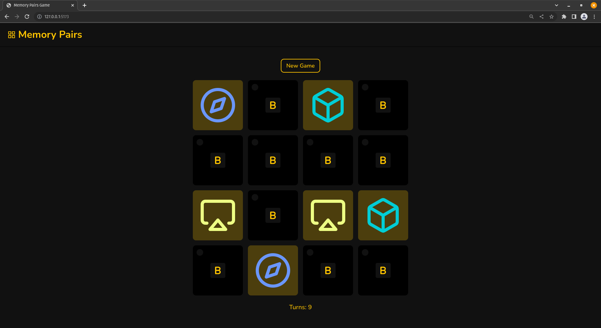

# React Memory Game

A simple game written in React in which all the cards are laid face down and two cards are flipped face up over each turn. If both the cards match, then they remain face up, otherwise they are flipped down. The objective of the game is to turn over pairs of matching cards.

